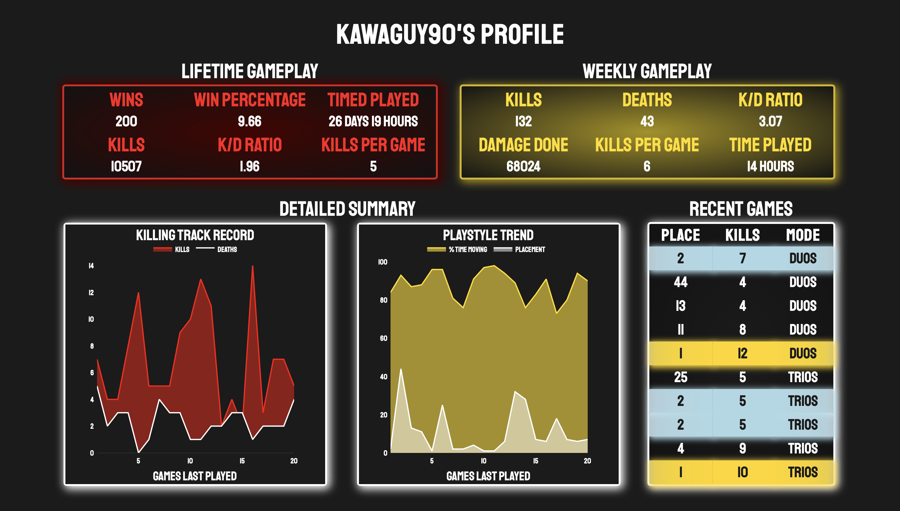
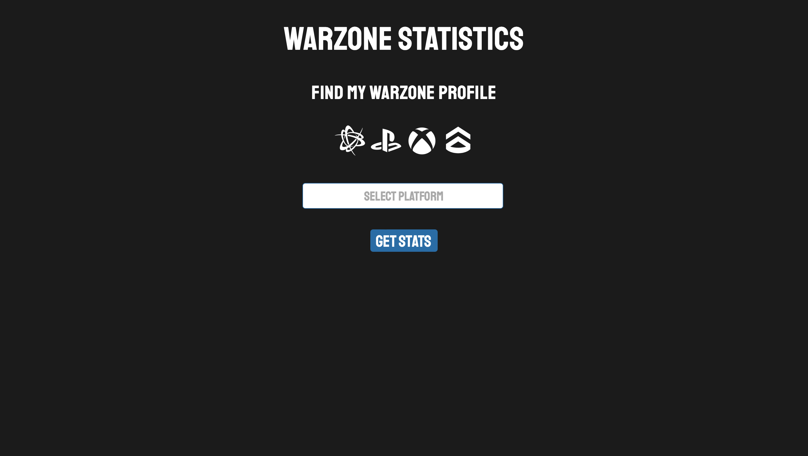

# Call of Duty: Warzone API Player Dashboard

<h3 align="center"><a href="http://MichaelPoma.PythonAnywhere.com" target="_blank"><b>MichaelPoma.PythonAnywhere.com</b></a></h3>

- Developed interactive, real-time dashboard of lifetime, weekly, and recent game data for Warzone players
- Retrieved statistics from Call of Duty API based on user gamertag and platform with data validation
- Publically available for current, past, and future Call of Duty: Warzone players
- Deployed web app via Flask for continuous uptime and availability

## Demo Dashboard
<p align="center">
    
</p>


## Code and Resources Used

**Languages:** Python, JavaScript, HTML, CSS

**Python Version:** 3.8.12

**Packages:** flask, requests, json, pandas, numpy, matplotlib, time, datetime, io, base64, plotly

**Host API Link:** https://rapidapi.com/elreco/api/call-of-duty-modern-warfare/

## Data Collection

The data was collected via RapidAPI's Call of Duty: Modern Warefare API in 3 API calls.

Lifetime summary statistics consisted of the following:
- Wins, Win Percentage
- Kills, Kill Death Ratio, Kills Per Game
- Time Played

Weekly summary statistics included:
- Kills, Deaths, Kill Death Ratio, Kills Per Game
- Damage Done
- Time Played

Recent game data included statistics of 20 most recent matches:
- Team Placement
- Kills
- Game Mode
- Percent Time Moving

Two graphs were also developed to display trends of the 20 most recent games:
- Kills VS Deaths
- Percent Time Moving VS Team Placement
## API Reference

#### Header Parameters
| Parameter  | Type     | Description                 |
| :--------  | :------- | :------------------------------ |
| `X-RapidAPI-Key`  | `string` | **Required**. API key       |
| `X-RapidAPI-Host`  | `string` | **Required**. call-of-duty-modern-warfare.p.rapidapi.com |

#### URL Parameters

| Parameter  | Type     | Description                 |
| :--------  | :------- | :-------------------------- |
| `gamertag` | `string` | **Required**. User gamertag |
| `platform` | `string` | **Required**. User platform |

#### Get lifetime summary statistics

```http
  GET /X-RapidAPI-Host/warzone/{gamertag}/{platform}
```

#### Get recent 20 game data

```http
  GET /X-RapidAPI-Host/warzone-matches/{gamertag}/{platform}
```
#### Get general match summary statistics

```http
  GET /X-RapidAPI-Host/warzone-match/{gamertag}/{platform}
```

**Note:** Application runs using my API keys. A personal API key is only required for local testing.


## Deployment

App deployed via Flask hosted on PythonAnywhere server. Reach at the link:

```bash
  MichaelPoma.PythonAnywhere.com
```


## Usage/Examples

#### Check out popular streamers such as:

| Platform  | Gamertag         |
| :--------  | :-------------- |
| `acti`  | `Symfuhny#5773991` |
| `battle`  | `DrDisrespect#1633` |
| `battle`  | `ZLaner#1347` |


#### Check out my profile too:

| Platform  | Gamertag         |
| :--------  | :-------------- |
| `battle`  | `Kawaguy90#1610` |

#### Direct Link:

```javascript
http://michaelpoma.pythonanywhere.com/?platform=battle&gamertag=kawaguy90%231610
```


## Landing Page

<p align="center">
  
</p>

## Monitoring

Due to changes with the host API, application might not always run as intended, as certain changes to API calls and data preprocessing is necessary.
- Last updated on Feb 2023:
    - Weekly Stats API call no longer supported. Converted to summary of recent 20 games
    - Lifetime and 20 games GET requests updated accordingly due to indexing changes

